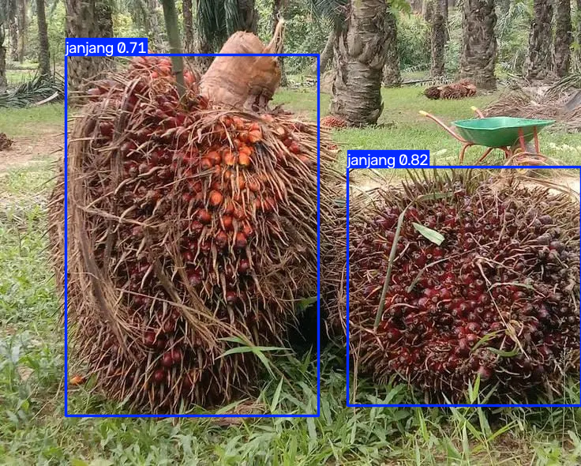

# Janjang Vision

Janjang Vision is an AI-powered project for detecting and counting oil palm fresh fruit bunches (FFB), locally known as "janjang", using computer vision and YOLO object detection.

The system is designed to help automate fruit counting in palm oil farms, inspection workflows, and image/video-based monitoring. It supports image detection, video processing, live camera detection, and custom model training using a YOLO-compatible dataset.

## Project Overview

This project uses the Ultralytics YOLO framework to identify oil palm fruit bunches in images and video streams. It detects objects with bounding boxes and counts the number of detected bunches based on confidence threshold and optional class filtering.

The main workflow includes:

- detecting fruit bunches in still images
- processing video footage for counting
- monitoring in real time from a webcam
- training a custom YOLO model from a labeled dataset
- exporting annotated result images and videos

## Features

- YOLO-based object detection for palm fruit bunches
- Image counting from JPG/PNG inputs
- Video counting from MP4 or other OpenCV-supported video sources
- Real-time camera detection
- Automatic class detection for relevant labels such as `janjang`, `tbs`, `ffb`, `bunch`, and similar names
- Confidence threshold control using `--conf`
- Custom class filtering using `--classes`
- Model training via `dataset.yaml`
- Output saving for processed images and videos

## Project Structure

```text
janjang-vision/
├── janjang_counter.py          # Main detection / training script
├── janjang_train_merged.ipynb  # Notebook for merging Roboflow datasets and training
├── janjang_colab.ipynb         # Notebook version for Colab workflow
├── merged_best.pt              # Recommended merged model checkpoint
├── gcstech.pt                  # Model checkpoint from gcstech dataset
├── model_2.pt                  # Additional checkpoint
├── SawitMVC.pt                 # Another trained checkpoint
├── yolo11n.pt                  # Base YOLO11 pre-trained model
├── ffb_check.jpg               # Example validation image
├── foto_uji.png                # Sample test image
├── runs/                       # YOLO training/inference outputs
│   └── detect/
├── README.md                   # Project documentation
├── train_log.txt               # Training logs
├── train_log_v2.txt            # Training logs v2
├── train_log_v2full.txt        # Full training logs
├── __pycache__/                # Python cache files
├── .git/                       # Git metadata
├── .vscode/                    # editor config
└── .gitignore
```

Note: the project currently uses root-level checkpoints and output folders rather than a single `dataset/` folder in the workspace. If you want to retrain, you can create a custom `dataset/` folder or point the training command to a custom `data.yaml` file.

## Requirements

Install the required Python packages:

```bash
pip install ultralytics opencv-python
```

## Download Model from Google Drive

The recommended trained model is stored in Google Drive and is named `merged_best.pt`.

- Google Drive folder: https://drive.google.com/drive/folders/1TpYLqy0NLaXq-XeoPMsomkt-K25bPUtk?hl=ID

Download the file `merged_best.pt` and place it in the project root folder so the script can load it directly.

Example:

```bash
python janjang_counter.py foto.jpg --model merged_best.pt --conf 0.25
```

This is the recommended model to use for validation and inference when you want the latest merged training result.

## Download Dataset from Roboflow

This project can use the public Roboflow oil palm fruit bunch dataset:

- https://universe.roboflow.com/gcstech/oil-palm-fruit-bunch-vlynl/dataset/2

Use it as the main data source for retraining or comparing with the existing model checkpoints such as `model_1.pt`.

Recommended workflow:

1. Open the dataset page above.
2. Click the download button.
3. Choose export format: `YOLOv8` (or `YOLOv5/YOLOv8` depending on the export option).
4. Download and unzip the package into the project folder.
5. Make sure the extracted folder contains `data.yaml`, `train`, `val`, and `test` folders.
6. Point the training command to the downloaded YAML file.

Example:

```bash
python janjang_counter.py --train dataset/data.yaml --epochs 100 --imgsz 640
```

If the exported directory does not match the project structure, move the files so that they look like this:

```text
project/
├── dataset/
│   ├── data.yaml
│   ├── images/
│   └── labels/
├── janjang_counter.py
├── best.pt
└── model_1.pt
```

This dataset is suitable for fruit bunch detection and can be used to retrain the model, validate new checkpoints, or compare against the current `best.pt` and `model_1.pt` results.

## Quick Start

### 1. Run object detection on an image

Recommended model:

```bash
python janjang_counter.py image.jpg --model merged_best.pt --conf 0.25
```

If you want to use an older checkpoint instead:

```bash
python janjang_counter.py image.jpg --model gcstech.pt --classes 0,1,2,3,4 --conf 0.25
```

### 2. Run detection on a video

```bash
python janjang_counter.py --video input_video.mp4 --model merged_best.pt --save
```

This is the correct video mode for the current script. The `--save` flag saves the annotated output video beside the input file.

### 3. Use the webcam

```bash
python janjang_counter.py --cam --model merged_best.pt
```

This opens the live webcam stream and displays detections in real time. In the current implementation, webcam mode does not save a video file automatically.

### 4. Train a custom model

```bash
python janjang_counter.py --train dataset/dataset.yaml --epochs 100 --imgsz 640
```

## Model and Class Handling

The script automatically tries to detect labels related to fruit bunches. If a custom model uses class names like:

- `janjang`
- `tbs`
- `ffb`
- `bunch`
- `fruit_bunch`

it will identify the object class that matches and count only those relevant detections.

## Dataset

The project includes a YOLO-style dataset structure under the `dataset/` folder. The training configuration is stored in `dataset/dataset.yaml` and includes:

- training image folder
- validation image folder
- number of classes
- class names

This allows the model to be trained for the custom palm fruit bunch detection task.

## Output

The program can generate:

- annotated prediction images with bounding boxes
- saved result files such as `*_hasil.jpg` or `*_hasil.png`
- processed video outputs when `--save` is enabled
- training checkpoints and logs under the `runs/` directory

### Example detection result

This result was generated using the recommended model checkpoint: `merged_best.pt`.

Input image: `ffb_check.jpg`  
Output image: `ffb_check_hasil.png`



## Notes

- The default `yolo11n.pt` model is a general pretrained COCO model and is not specialized for palm fruit detection.
- For better field accuracy, you should collect labeled images of actual fruit bunches, annotate them, and retrain the model with your custom dataset.
- The system is useful for agricultural monitoring, harvest estimation, and inspection support.

## Example Use Case

This project is suitable for counting fresh fruit bunches in palm plantations, where the goal is to estimate the number of bunches from field images or surveillance videos. It can assist in:

- field inspection
- fruit counting automation
- harvest planning support
- AI-based agricultural monitoring

## License

This project is intended for research, educational, and practical agricultural vision use. Please ensure compliance with the licensing terms of the dependencies used in the project.
